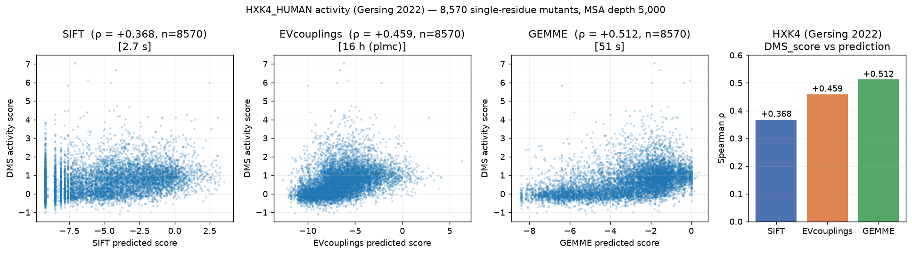

# pg2_models

Drop-in `evedesign` model wrappers for two MSA-based protein mutation effect
predictors:

- **SIFT** — Sorting Intolerant From Tolerated
  ([Ng & Henikoff 2003](https://doi.org/10.1101/gr.176601))
- **GEMME** — Global Epistatic Model for predicting Mutational Effects
  ([Laine, Karami, Carbone 2019](https://doi.org/10.1093/molbev/msz179))

## Benchmark

Spearman ρ between predicted and measured DMS scores on the
[Gersing 2022](https://doi.org/10.1101/2022.10.10.511562) HXK4_HUMAN
dataset (8,570 single-residue mutants).



## GEMME — quick start

```python
from evedesign.models.gemme import GEMME
from evedesign.system import Protein, System
from evedesign.sequence import Sequence, Sequences

target = "MKLAVTSGGEFA"
homologs = ["MKLAVTSGGEFA", "MRLAVASGGEFA", "MKLAITAGGEFA",
            "MKLPVTSGGEFA", "MKLAVTSGAEFA", "MKLAVTSGGEYA"]
msa = Sequences(
    seqs=[Sequence(seq=s, id=f"h{i}") for i, s in enumerate(homologs)],
    aligned=True, type="protein", format="fasta",
)
system = System([Protein(id="toy", rep=target, first_index=1, sequences=msa)])

# build = run GEMME from the local source tree and load the score matrix.
# `gemme_path` / `jet_path` default to the GEMME_PATH / JET_PATH env vars,
model = GEMME(n_iter=1, n_seqs=2000).build(system)

# full L x 20 single-mutation effect matrix (higher = more native-like)
scan = model.single_mutation_scan(system.rep_to_instance(), entity=0)
print(scan.iloc[:3].round(2))

# score arbitrary mutants (singles served from cache; multi-site triggers
# a second GEMME run with -m mutations.txt)
from evedesign.system import Mutation
muts = [
    [Mutation(entity=0, pos=4, ref="A", to="V")],
    [Mutation(entity=0, pos=5, ref="V", to="L"),
     Mutation(entity=0, pos=8, ref="G", to="A")],
]
print(model.score_mutants(system.rep_to_instance(), muts))
```

## SIFT — quick start

```python
import os
os.environ.setdefault("SIFT_HOME", "/path/to/sift6.2.1")  # or pass sift_home=

from evedesign.models.sift import SIFT
from evedesign.system import Protein, System
from evedesign.sequence import Sequence, Sequences

target = "MKLAVTSGGEFA"
homologs = ["MKLAVTSGGEFA", "MRLAVASGGEFA", "MKLAITAGGEFA",
            "MKLPVTSGGEFA", "MKLAVTSGAEFA"]
msa = Sequences(
    seqs=[Sequence(seq=s, id=f"h{i}") for i, s in enumerate(homologs)],
    aligned=True, type="protein", format="fasta",
)
system = System([Protein(id="toy", rep=target, first_index=1, sequences=msa)])

model = SIFT().build(system)               # invokes info_on_seqs
scan  = model.single_mutation_scan(system.rep_to_instance(), entity=0)
print(scan.iloc[:3].round(2))
```

## Score conventions

Both wrappers follow the _higher = more native-like_ convention, so
`single_mutation_scan` values can be correlated directly with DMS activity
scores via `scipy.stats.spearmanr` without sign flipping. The diagonal
(WT residue) is exactly `0.0`; positions a model could not score are
returned as all-NaN rows.
